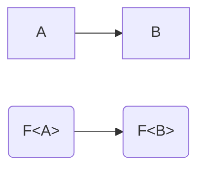
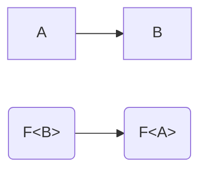
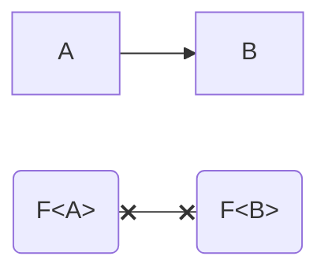
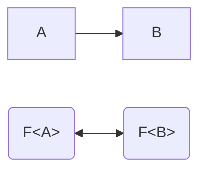

# Variance in functions

When we say "variance", we are trying to describe how one type `F<A>` "varies" with another type `F<B>`.
In other words, variance describes the relationship between `F<A>` and `F<B>` given `A` and `B`.

### Covariance

For our first example, let's imagine that `A` is assignable to `B`, and we'll use this graph below, where an arrow represents assignability.
Then, if `F<A>` is assignable `F<B>`, we call that behaviour **covariance**.
The relationship of `F<A>` and `F<B>` _co-varies in the same direction_ with the relationship of `A` and `B`.



In functions, it just so happens that their _return types_ are covariant.

```ts
type F<V> = () => V;

function covariance<B, A extends B>(a: A, b: B, coA: F<A>, coB: F<B>) {
    b = a; // Okay, A is assignable to B
    a = b; // Error, B is NOT assignable to A

    // Covariant types "match" the type parameter's relationship

    coB = coA; // Okay, since F<...> is covariant
    coA = coB; // Error, since F<...> is covariant
}
```

Another example of covariance in TypeScript is in mutable arrays and object properties.
If you have `A extends B`, then `A[] extends B[]` is also true.
However, this is actually **unsound**!
Read [this answer][unsoundarrays] if you are interested in why.

### Contravariance

However, for contravariance, instead of `F<A>` being assignable to `F<B>`, we have `F<B>` being assignable to `F<A>` (`A` is still assignable to `B`).
Essentially, the directions flip, and `F<A>` and `F<B>` _contra-varies in the opposite directions_.



So how does this relate to functions?
It's actually a pretty common misunderstanding that functions are covariant, but they're actually only covariant with respect to their return types.
Instead, their parameters are **contravariant**.

But why? Let's look at a simple example. Imagine that we have this code:

```ts
function onlyHello(string: "hello") {
    console.log(string + " world");
}

function passString(fn: (string: string) => void) {
    fn("goodbye");
}

passString(onlyHello);
```

`onlyHello` only wants `"hello"`, a string literal type.
`passString` wants a function that can take any string, and it happens to pass `"goodbye"` as the argument.
If functions were covariant by their return types, `onlyHello` would be given `"goodbye"` in this code snippet!
Notice that `"hello"` is assignable to `string`, but `(string: "hello") => void` is not assignable to `(string: string) => void`.
In fact, it's the other way around: `(string: string) => void` is assignable to `(string: "hello") => void`.

Thankfully, TypeScript catches the error:

```ts
passString(onlyHello);
//         ~~~~~~~~~ Type 'string' is not assignable to type '"hello"'.
```

Now back to the original example with `F`:

```ts
type F<V> = (value: V) => void;

function contravariance<B, A extends B>(a: A, b: B, contraA: F<A>, contraB: F<B>) {
    b = a; // Okay, A is assignable to B
    a = b; // Error, B is NOT assignable to A

    // Contravariant types are the opposite of the type parameter's relationship

    contraB = contraA; // Error, since F<...> is contravariant
    contraA = contraB; // Okay, since F<...> is contravariant
}
```

### Invariance

Now, what happens if we have _both_ a covariant and contravariant type?
It becomes **invariant**, meaning that it no longer varies with respect to the relationship of `A` and `B`.
If `F` is invariant, then `F<A>` is not assignable to `F<B>` and `F<B>` is not assignable to `F<A>`.
This is actually what happens most of the time!



In invariant types, it actually doesn't matter if `A extends B` or if `B extends A`; the resulting types `F<A>` and `F<B>` will never be assignable to each other anyways.
So where could this happen? Well, if you combine the last two examples of covariance and contravariance, you get:

```ts
type F<V> = (value: V) => V;

function invariance<B, A extends B>(a: A, b: B, inA: F<A>, inB: F<B>) {
    b = a; // Okay, A is assignable to B
    a = b; // Error, B is NOT assignable to A

    // Invariant types disregard the relationship between A and B
    // Assignments between F<A> and F<B> *never* work

    inB = inA; // Error, since F<...> is invariant
    inA = inB; // Error, since F<...> is invariant
}
```

### Bivariance

This is like the opposite of invariance.
It is neither covariant or contravariant.
If `A` is assignable to `B`, then `F<A>` is assignable to `F<B>` and `F<B>` is assignable to `F<A>`, and similarly to invariance, it doesn't actually matter if `A extends B` or if `B extends A`.
If a type satisfies this behaviour, it is **bivariant**, meaning it varies with and against the relation between `A` and `B`.



It is possible to demonstrate that only _constant_ types are truly bivariant:

```ts
type F<T> = number;
```

1. `T extends unknown` is true for all `T`.
2. That means `F<T> extends F<unknown>`.
3. And also `F<unknown> extends F<T>`.
4. If `A extends B` and `B extends A`, (in a sound type system) `A` and `B` are the same.
5. `F<T>` and `F<unknown>` are the same for all T.
6. `F<T>` must be a constant.

In a sound type system, this essentially never happens for any non-trivial definition.
Lucky for us, TypeScript is unsound.
There is only one notable case where TypeScript demonstrates bivariance, and that is the parameter type of methods:

```ts
type F<V> = { method(v: V): void };

function bivariance<B, A extends B>(a: A, b: B, biA: F<A>, biB: F<B>) {
    b = a; // Okay, A is assignable to B
    a = b; // Error, B is NOT assignable to A

    // Bivariant types disregard the relationship between A and B
    // Assignments between F<A> and F<B> *always* work

    inB = inA; // Okay, since F<...> is bivariant
    inA = inB; // Okay, since F<...> is bivariant
}
```

### `in`/`out` modifiers

[unsoundarrays]: https://stackoverflow.com/a/60922930/18244921
