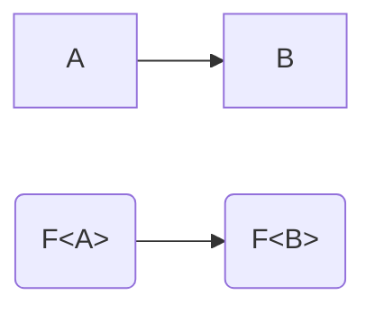

# Variance in functions

When we say "variance", we are trying to describe how one type `F<A>` "varies" with another type `F<B>`.
In other words, variance describes the relationship between `F<A>` and `F<B>` given `A` and `B`.

### Covariance

For our first example, let's imagine that `A` is assignable to `B`, and we'll use this graph below, where an arrow represents assignability.
Then, if `F<A>` is assignable `F<B>`, we call that behaviour **covariance**.
The relationship of `F<A>` and `F<B>` _co-varies in the same direction_ with the relationship of `A` and `B`.

{: .mx-auto }



In functions, it just so happens that their _return types_ are covariant.

```ts
type F<V> = () => V;

function covariance<B, A extends B>(a: A, b: B, coA: F<A>, coB: F<B>) {
    b = a; // Okay, A is assignable to B
    a = b; // Error, B is NOT assignable to A

    // Covariant types "match" the type parameter's relationship

    coB = coA; // Okay, since F<...> is covariant
    coA = coB; // Error, since F<...> is covariant
}
```

Another example of covariance in TypeScript is in mutable arrays and object properties.
If you have `A extends B`, then `A[] extends B[]` is also true.
However, this is actually **unsound**!
Read [this answer][unsoundarrays] if you are interested in why.

### Contravariance

[unsoundarrays]: https://stackoverflow.com/a/60922930/18244921
